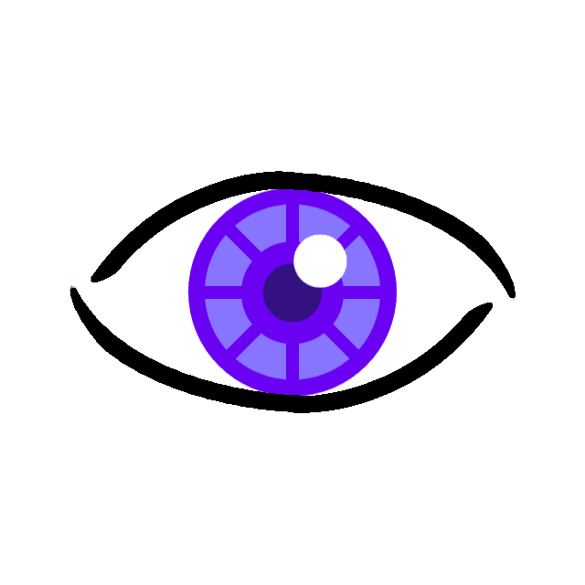

<h1 align="center">
  <br>
  
  <br>
  IRIS — Intelligent Retinal Interface System
  <br>
</h1>

<h4 align="center">AI-Powered Smart Glasses for the Visually Impaired</h4>

<p align="center">
  
  
  
  
  
</p>

<p align="center">
  <a href="#overview">Overview</a> •
  <a href="#architecture">Architecture</a> •
  <a href="#features">Features</a> •
  <a href="#repository-structure">Repository Structure</a> •
  <a href="#hardware-setup">Hardware Setup</a> •
  <a href="#software-setup">Software Setup</a> •
  <a href="#android-app">Android App</a> •
  <a href="#tech-stack">Tech Stack</a>
</p>

---

## Overview

**IRIS** (Intelligent Retinal Interface System) is a **Third Year Engineering project** that aims to help **visually impaired individuals** navigate and understand the world around them through AI-powered smart glasses. IRIS combines computer vision, natural language processing, and speech synthesis to provide real-time, audio-based feedback about the user's surroundings.

The system consists of three integrated components:
1. **Smart Glasses Hardware** — Raspberry Pi-powered wearable with a Pi Camera
2. **AI Processing Server** — Python backend running AI/ML inference on a GPU-enabled machine
3. **Android Companion App** — Mobile app for configuration and on-the-go access

> **Project started:** February 2025 | **Status:** Actively in development

---

## Architecture

```
┌─────────────────────────────────────────────────────────────────┐
│                        IRIS System Architecture                  │
└─────────────────────────────────────────────────────────────────┘

  ┌──────────────────┐         TCP Socket          ┌──────────────────────┐
  │  Smart Glasses   │  ◄────────────────────────► │   AI Server (PC/GPU) │
  │  (Raspberry Pi)  │     JSON over TCP/IP         │   (Python Backend)   │
  │                  │                              │                      │
  │ • Pi Camera      │  ──── Base64 Image ────►    │ • Object Detection   │
  │ • YOLOv8 (local) │  ◄──── AI Results ────       │ • Face Recognition   │
  │ • Microphone     │                              │ • Image Captioning   │
  │ • Speaker / TTS  │  ──── Voice Command ────►   │ • OCR / Text Read    │
  │ • Speech Recog.  │                              │ • Barcode / QR Scan  │
  └──────────────────┘                              │ • LLM (Gemini API)   │
                                                    └──────────────────────┘
  ┌──────────────────┐
  │  Android App     │   (Standalone / Companion)
  │  (Kotlin)        │
  │                  │
  │ • TFLite Model   │   SSD MobileNet V1
  │ • CameraX Live   │   LVIS-trained model
  │ • Object Labels  │
  └──────────────────┘
```

### How It Works

1. The **Raspberry Pi client** (`client.py`) captures frames from the Pi Camera using `picamera2`.
2. A **local YOLOv8 model** runs directly on the RPi for low-latency obstacle/object detection.
3. For heavier AI tasks, frames are **encoded as Base64** and sent over a TCP socket to the AI server.
4. The **AI server** (`server.py`) processes requests and returns JSON results: captions, recognized faces, OCR text, barcode data, etc.
5. Results are **spoken aloud** via `pyttsx3` (Text-to-Speech) on the RPi's speaker.
6. The user can also **speak voice commands** (via `SpeechRecognition`) to query the system.

---

## Features

### 🔍 Object Detection
- **On-device (RPi):** YOLOv8 nano model runs locally for real-time detection of obstacles and common objects — **no server round-trip needed**.
- **Android App:** SSD MobileNet V1 and a custom LVIS-trained TFLite model for mobile inference.
- **Alias System:** Detected objects are mapped to user-friendly spoken aliases (e.g., "person" → "someone is nearby").

### 🗣️ Image Captioning
- Uses the `nlpconnect/vit-gpt2-image-captioning` model (ViT + GPT-2 architecture) on the server.
- Generates natural language descriptions of the user's surroundings.
- Multiple caption candidates are combined and refined via **Gemini 1.5 Flash** for greater accuracy.

### 👤 Face Recognition
- **DeepFace** generates 4096-dimensional face embeddings from captured images.
- Embeddings are stored in a **ChromaDB vector database** (`face_embeddings` collection, cosine similarity).
- Users can register faces; IRIS then identifies known people by name and speaks it aloud.

### 📖 OCR — Read Text
- Uses **Tesseract OCR** (`pytesseract`) to extract text from images.
- Supports reading signs, printed text, product labels, and documents.
- Results are cleaned and spoken aloud.

### 📦 Barcode & QR Code Scanning
- Detects and decodes **barcodes** and **QR codes** using OpenCV / `pyzbar`.
- Fetches **online product information** for barcodes (product name, ingredients, etc.).
- Results are summarized by **Gemini 1.5 Flash** and read to the user.

### 🤖 LLM Integration (Gemini 1.5 Flash)
- Google Gemini API is used throughout for:
  - Combining and refining image captions from multiple passes
  - Summarizing product/barcode data in plain language
  - Answering free-form user queries about the scene
  - Cleaning and contextualizing OCR output
- A **persistent multi-turn chat session** is maintained for contextual conversations.

### 🎙️ Voice Interface
- **Speech Recognition:** User speaks commands into the RPi's microphone.
- **Text-to-Speech:** `pyttsx3` provides immediate audio feedback through a connected speaker.
- Commands trigger specific AI modes: caption, read text, detect objects, recognize face, etc.

### 📱 Android Companion App
- Built with **Kotlin + Jetpack Compose** and **CameraX**.
- Runs object detection locally on the phone using **TensorFlow Lite** (no server needed).
- Live camera preview with annotated bounding boxes.
- Configurable via `SettingsActivity`.

---

## Repository Structure

```
IRIS-TY-Project/
│
├── app/                                    # 📱 Android App (Kotlin)
│   └── src/main/
│       ├── java/com/example/cameratesting/
│       │   ├── MainActivity.kt             # Core app: CameraX, TFLite inference loop
│       │   ├── SettingsActivity.kt         # User settings screen
│       │   └── ui/theme/
│       │       ├── Alias.kt                # Object label alias definitions
│       │       ├── AliasMatcher.kt         # Maps detected labels → spoken aliases
│       │       ├── Color.kt                # UI color palette
│       │       ├── Theme.kt                # Compose Material theme
│       │       └── Type.kt                 # Typography configuration
│       ├── assets/
│       │   ├── labels.txt                  # Active object detection class labels
│       │   ├── labels_original.txt         # Original COCO labels (80 classes)
│       │   └── labels_Somechanged.txt      # Modified label set
│       ├── ml/
│       │   ├── ssd_mobilenet_v1_1_metadata_1.tflite   # SSD MobileNet V1 (~4MB)
│       │   └── trained_on_lvis.tflite                 # Custom LVIS model (~15MB)
│       └── res/layout/
│           ├── activity_main.xml           # Main UI layout
│           └── activity_settings.xml       # Settings UI layout
│
├── python/                                 # 🖥️ AI Server & Utilities
│   ├── server.py                           # Main TCP server — dispatches AI tasks
│   ├── image_captioning.py                 # ViT-GPT2 image captioning
│   ├── face_recognition.py                 # DeepFace-based face recognition
│   ├── vectordb.py                         # ChromaDB vector database for faces
│   ├── nlp_utils.py                        # Gemini API: summarize, LLM query, combine
│   ├── ocr_utils.py                        # Tesseract OCR wrapper
│   ├── object_detection.py                 # Server-side object detection (OpenCV)
│   ├── barcode_qrcode.py                   # Barcode/QR decode + product info fetch
│   ├── vectordb_old_faiss.py               # Legacy: FAISS vector store
│   ├── vectordb_old_chroma.py              # Legacy: early ChromaDB implementation
│   ├── deepseek-r1-1-5b-test.py            # Experimental: local LLM (DeepSeek R1)
│   ├── mistral-test.py                     # Experimental: Mistral LLM test
│   ├── check-cuda.py                       # CUDA availability checker
│   ├── requirements.txt                    # Server Python dependencies
│   ├── requirements-cuda-12-4.txt          # CUDA 12.4-specific dependencies
│   │
│   └── smart-glasses-client/               # 🥽 Raspberry Pi Client
│       ├── copy-to-rpi.ps1                 # PowerShell SCP helper (Windows → RPi)
│       ├── scp-readme.txt                  # SCP/SSH usage instructions
│       └── iris-client-rpi/
│           ├── client.py                   # Main RPi client: camera, socket, voice
│           ├── nlp_utils_client.py         # LLM utilities (Gemini, RPi-side)
│           ├── object_detection.py         # Local YOLOv8 inference on RPi
│           ├── tts.py                      # Text-to-Speech via pyttsx3
│           ├── speech_rec.py               # Voice command input
│           ├── vqa.py                      # Visual Question Answering
│           ├── soundtest.py                # Audio hardware test utility
│           ├── start_client.sh             # Bash startup script (autostart)
│           └── requirements.txt            # RPi Python dependencies
│
├── Project Diary/
│   └── Project-Timeline.txt               # Development milestones log
│
├── logo.png                               # Project logo (white background)
├── logo_no_bg.png                         # Project logo (transparent background)
├── logo_bg.png                            # Project logo variant
└── logo_thin_lines.png                    # Project logo thin-line variant
```

---

## Hardware Setup

### Required Components

| Component | Recommended Spec | Purpose |
|-----------|-----------------|---------|
| **Raspberry Pi** | RPi 4B / 5 (4GB+ RAM) | Main wearable compute unit |
| **Pi Camera Module** | Camera Module 3 / v2 | Primary vision sensor |
| **Microphone** | USB microphone | Voice command input |
| **Speaker** | USB / 3.5mm speaker | TTS audio output |
| **Server PC / Laptop** | GPU with CUDA support | AI model inference |
| **WiFi Network** | 5GHz recommended | RPi ↔ Server communication |
| **Power Bank** | High-capacity (for RPi) | Portable power supply |

### Network Setup
- Both the **Raspberry Pi** and the **AI Server PC** must be on the **same local network**.
- All communication happens over **TCP sockets on port 55555** (configurable).
- The server's IP address is saved in a `server_ip` file on the RPi.

---

## Software Setup

### 1. AI Server (PC / GPU Machine)

**Prerequisites:**
- Python 3.10+
- CUDA toolkit (optional but recommended for GPU acceleration)
- [Tesseract OCR](https://github.com/tesseract-ocr/tesseract) installed system-wide

```bash
# Clone the repository
git clone https://github.com/r-r-dandekar/IRIS-TY-Project.git
cd IRIS-TY-Project/python

# Install Python dependencies
pip install -r requirements.txt

# For CUDA 12.4 GPU support (faster inference)
pip install -r requirements-cuda-12-4.txt

# Set up your Gemini API key
echo "GEMINI_API_KEY=your_api_key_here" > .env

# Start the server on default port 55555
python server.py

# Or specify a custom port
python server.py 55556
```

> **Get a free Gemini API key at:** https://aistudio.google.com/

### 2. Raspberry Pi Client

```bash
# SSH into your Raspberry Pi and navigate to the client directory
cd python/smart-glasses-client/iris-client-rpi

# Create a virtual environment with system-site-packages
# (required for picamera2 which is installed system-wide)
python -m venv --system-site-packages venv3.11.2
source venv3.11.2/bin/activate

# Install dependencies
pip install --upgrade numpy
pip install ultralytics
pip install --force-reinstall simplejpeg
pip install -r requirements.txt

# Save the AI server's IP address
echo "192.168.x.x" > server_ip

# Run the client
python client.py

# Or use the startup script (suitable for autostart on boot)
bash start_client.sh
```

### 3. Copying Files to the RPi (from Windows)

A PowerShell helper script is provided for easy deployment:

```powershell
# From the project root on your Windows machine
.\python\smart-glasses-client\copy-to-rpi.ps1
```

This uses **SCP** to securely copy the client files to the Raspberry Pi over the network.

---

## Android App

The Android companion app provides **standalone mobile-based object detection** — no glasses hardware required.

### Build Requirements
- Android Studio (Ladybug or newer)
- Android SDK 35 (Target), SDK 24 minimum (Android 7.0+)
- Kotlin 1.9+

```bash
# Build via Gradle CLI
./gradlew assembleDebug
# or
gradlew.bat assembleDebug   # on Windows
```

### Key App Dependencies

| Library | Purpose |
|---------|---------|
| **CameraX** | Live camera preview and frame capture |
| **TensorFlow Lite** | On-device ML inference |
| **Jetpack Compose** | Declarative UI framework |
| **Material3** | Modern UI design components |

---

## Tech Stack

### 🧠 AI / ML

| Technology | Where Used | Purpose |
|------------|-----------|---------|
| **YOLOv8** (Ultralytics) | Raspberry Pi | Real-time local object detection |
| **SSD MobileNet V1** (TFLite) | Android | Mobile object detection |
| **Custom LVIS TFLite Model** | Android | Extended category object detection |
| **ViT-GPT2** (HuggingFace) | Server | Image captioning |
| **DeepFace** | Server | Face embedding extraction |
| **ChromaDB** | Server | Vector database for face recognition |
| **FAISS** | Server (legacy) | Alternative vector similarity search |
| **Gemini 1.5 Flash** | Server | LLM summarization, Q&A, caption refinement |
| **Tesseract OCR** | Server | Optical character recognition |
| **pyzbar + OpenCV** | Server | Barcode and QR code decoding |

### 📡 Communication

| Technology | Purpose |
|------------|---------|
| **TCP Sockets** | Real-time RPi ↔ Server data exchange |
| **JSON** | Structured data serialization |
| **Base64** | Binary image data transmission over sockets |
| **Heartbeat Protocol** | Keep-alive connection monitoring |

### 🔊 Audio (Raspberry Pi)

| Technology | Purpose |
|------------|---------|
| **pyttsx3** | Offline Text-to-Speech engine |
| **SpeechRecognition** | Voice command capture and transcription |

---

## Server Socket API Reference

Communication follows a **request-response JSON protocol** over TCP.

### Requests: RPi → Server

```json
// Keep-alive heartbeat
{"command": "heartbeat"}

// Generate image caption
{"command": "caption", "images": ["<base64_encoded_image>"]}

// OCR — read text in image
{
  "command": "ocr",
  "images": ["<base64_encoded_image>"],
  "extra_instructions": "focus on the largest text"
}

// Identify a person
{"command": "face_recognition", "images": ["<base64_encoded_image>"]}

// Add a new face to the database
{
  "command": "add_face",
  "images": ["<base64_image_1>", "<base64_image_2>"],
  "name": "Harshad"
}

// Scan barcode / QR code
{"command": "barcode", "images": ["<base64_encoded_image>"]}

// Ask a question to the LLM
{"command": "llm_query", "query": "What is in front of me?"}
```

### Responses: Server → RPi

```json
// Image caption
{"image_caption": "A street with parked cars and people walking on the sidewalk"}

// OCR result
{"ocr_text": "STOP — Road closed ahead until June 2025"}

// Face recognition
{"message": "That is Harshad"}

// Barcode / product info
{"message": "This is Maggi Masala Noodles, a 2-minute instant noodle product by Nestlé."}

// Heartbeat acknowledgment
{"heartbeat_ack": true}
```

---

## Development Timeline

| Date | Milestone |
|------|-----------|
| **03 Feb 2025** | Project topic finalized |
| **06 Feb 2025** | Object detection demonstrated — 15% complete |
| **TBD** | Face recognition, OCR, barcode scanning integrated |
| **TBD** | RPi client + server socket communication established |
| **TBD** | Voice command interface completed |
| **TBD** | LLM integration with Gemini API |
| **Ongoing** | Hardware assembly, testing, and refinement |

---

## Acknowledgements

This project builds on several open-source tools and public AI APIs:

- [Ultralytics YOLOv8](https://github.com/ultralytics/ultralytics)
- [HuggingFace Transformers](https://huggingface.co/nlpconnect/vit-gpt2-image-captioning)
- [DeepFace](https://github.com/serengil/deepface)
- [ChromaDB](https://www.trychroma.com/)
- [Google Gemini API](https://ai.google.dev/)
- [Tesseract OCR](https://github.com/tesseract-ocr/tesseract)
- [TensorFlow Lite](https://www.tensorflow.org/lite)
